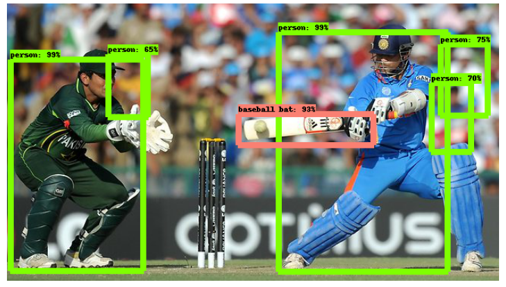

                                                      
                                               # OBJECT DETECTION USING TENSORFLOW
   # Object Detection using Tensorflow(By Ankan)
          
 
Abstract
Real-time object detection and tracking is a vast, vibrant yet inconclusive and complex area of computer vision. Due to its increased utilization in surveillance, tracking system used in security and many others applications have propelled researchers to continuously devise more efficient and competitive algorithms. The latest research on this area has been making great progress in many directions.  In the current manuscript, we give an overview of the necessity of object detection in today’s computing systems, outline the current main research directions, discuss on how our API algorithm works, and discuss open problems and possible future directions.
Key words: - Object Detection, Computer Vision, Tracking Systems, API algorithm.

Fig 1.Still Image Object Detection By Ankan:

Fig 2.Live Webcam Object Detection of Anik (Ankan's friend)

I. INTRODUCTION

A.What is object detection?

Given an image or a video stream, an object detection model can identify which of a known set of objects might be present and provide information about their positions within the image.

An object detection model is trained to detect the presence and location of multiple classes of objects. For example, a model might be trained with images that contain various pieces of fruit, along with a label that specifies the class of fruit they represent (e.g. an apple, a banana, or a strawberry), and data specifying where each object appears in the image.

When we subsequently provide an image to the model, it will output a list of the objects it detects, the location of a bounding box that contains each object, and a score that indicates the confidence that detection was correct.

B. Confidence score

To interpret these results, we can look at the score and the location for each detected object. The score is a number between 0 and 1 that indicates confidence that the object was genuinely detected. The closer the number is to 1, the more confident the model is.
Depending on your application, you can decide a cut-off threshold below which you will discard detection results. For our example, we might decide a sensible cut-off is a score of 0.5 (meaning a 50% probability that the detection is valid). In that case, we would ignore those objects whose scores are below 0.5.
The cut-off you use should be based on whether you are more comfortable with false positives (objects that are wrongly identified, or areas of the image that are erroneously identified as objects when they are not), or false negatives (genuine objects that are missed because their confidence was low).
For example, in the following image, a pear (which is not an object that the model was trained to detect) was misidentified as a "person". This is an example of a false positive that could be ignored by selecting an appropriate cut-off. In this case, a cut-off of 0.6 (or 60%) would comfortably exclude the false positive.

Fig 3.Still Image Object Detection

Fig 4.Live Webcam Object Detection

C. Location
For each detected object, the model will return an array of four numbers representing a bounding rectangle that surrounds its position. For the starter model we provide, the numbers are ordered as follows:
[	top,	left,	bottom,	right	]

The top value represents the distance of the rectangle’s top edge from the top of the image, in pixels. The left value represents the left edge’s distance from the left of the input image. The other values represent the bottom and right edges in a similar manner.

II. WHY DO WE NEED OBJECT DETECTION?

Object recognition allows robots and AI programs to pick out and identify objects from inputs like video and still camera images. Methods used for object identification include 3D models, component identification, edge detection and analysis of appearances from different angles. The first use case is a smarter retail checkout experience. This is a hot field right now after the announcement of Amazon Go stores.
Stores can be designed so they have smart shelves that track what a customer is picking from them. I did this by building two object detection models — one that tracks hand and captures what the hand has picked. And the second independent model that monitors shelf space.  By using two models you minimise the error from a single approach.Another application of computer vision for retail checkout can be that instead of scanning items one by one at a checkout system , everything is placed together and cameras are able to detect and log everything. Maybe we don’t even need a checkout lane. Shopping carts can be equipped with cameras and you can simply walk out with your cart which can bill you as you step out of the store! Won’t this be cool! I used the API to design a “mini” model with 3 random items and the model could easily detect what was placed and in what quantity. See GIF below. Through various experimentation, I found that the API performs very well even on items that are only partially visible.	

III. A GENERAL FRAMEWORK FOR OBJECT DETECTION

Typically, we follow three steps when building an object detection framework:

1.	First, a deep learning model or algorithm is used to generate a large set of bounding boxes spanning the full image (that is, an object localization component)
2.	Next, visual features are extracted for each of the bounding boxes. They are evaluated and it is determined whether and which objects are present in the boxes based on visual features (i.e. an object classification component)
3.	In the final post-processing step, overlapping boxes are combined into a single bounding box (that is, non-maximum suppression)
That’s it – we are ready with your first object detection framework!

A. Packages to be installed:

  1. pip install protobuf
  2. pip install pillow
  3. pip install lxml
  4. pip install Cython
  5. pip install jupyter
  6. pip install matplotlib
  7. pip install pandas
  8. pip install opencv-python 
  9. pip install tensorflow

#B. What is an API? Why do we need an API?

API stands for Application Programming Interface. An API provides developers a set of common operations so that they don’t have to write code from scratch.
In one sense, APIs are great time savers. They also offer users convenience in many cases. Think about it – Facebook users (including myself!) appreciate the ability to sign into many apps and sites using their Facebook ID. How do you think this works? Using Facebook’s APIs of course!
So in this article, we will look at the TensorFlow API developed for the task of object detection.

C. Packages imported description
Pycocotools - Tools for working with the MSCOCO dataset.

OS – The OS module in python provides functions for interacting with the operating system. OS, comes under Python's standard utility modules. This module provides a portable way of using operating system dependent functionality. Python os system input text to script.

Pathlib – Object oriented filesystem path. This module offers classes representing filesystem paths with semantics appropriate for different operating systems. Path classes are divided between pure path which provide purely computational operations without I/O, and concrete path, which inherit from pure paths but also provide I/O operations.

Numpy - NumPy is a general-purpose array-processing package. It provides a high-performance multidimensional array object, and tools for working with these arrays.

Six.moves.urlib – The six. moves module provides those modules under a common name for both Python2 and 3.  imports urllib when run with Python3 and imports a mixture of urllib , urllib2 

Sys - System-specific parameters and functions. The sys module provides information about constants, functions and methods of the Python interpreter.

Tarfile - The tarfile module makes it possible to read and write tar archives, including those using gzip, bz2 and lzma compression.

TensorFlow - TensorFlow is an open source software library for high performance numerical computation. Its flexible architecture allows easy deployment of computation across a variety of platforms (CPUs, GPUs, TPUs), and from desktops to clusters of servers to mobile and edge devices.

Zipfile - The ZIP file format is a common archive and compression standard. This module provides tools to create, read, write, append, and list a ZIP file.

Defaultdict – Dictionary in Python is an unordered collection of data values that are used to store data values like a map. A Dictionary can be created by placing a sequence of elements within curly {} braces, separated by ‘comma’.

StringIo - This module implements a file-like class, StringIo, that reads and writes a string buffer (also known as memory files). See the description of file objects for operations. It can be initialized to an existing string by passing the string to the constructor.

Pyplot – Pyplot is a collection of command style functions that make matplotlib work like MATLAB. Each pyplot function makes some change to a figure: e.g., creates a figure, creates a plotting area in a figure, plots some lines in a plotting area, decorates the plot with labels, etc.

Image - Python Imaging Library which provides the python interpreter with image editing capabilities.

Display - When this object is returned by an expression or passed to the display function, it will result in the data being displayed in the frontend. The MIME type of the data should match the subclasses used, so the Png subclass should be used for ‘image/png’ data.

Ops - Operator framework charms are just Python code. The entry point to your charm is a particular Python file. It could be anything that makes sense to your project.
Label_map_util – This is needed since the notebook is stored in the object_detection folder.

D. TensorFlow Object Detection API

The TensorFlow object detection API is the framework for creating a deep learning network that solves object detection problems.
There are already pretrained models in their framework which they refer to as Model Zoo. This includes a collection of pretrained models trained on the COCO dataset, the KITTI dataset, and the Open Images Dataset. These models can be used for inference if we are interested in categories only in this dataset.

E. How to load the model?

Start

Step 1: First asking pip to install-U--pretensorflow=="2.*"

Step 2: Then ask pip to installpycocotools package.

Step 3: We have to importos and pathlib packages.

Step 4: Checking if"models"inpathlib.Path.cwd().parts, then Step 5.

Step 5: while"models"inpathlib.Path.cwd().parts,then Step 6.

Step 6: os.chdir('..')

Step 7: else ifnotpathlib.Path('models').exists(), then Step 8.

Step 8: gitclone--depth1https://github.com/tensorflow/models

Step 9: Compile protobufs and install the object_detection package

Step 10: importnumpyasnp,os,six.moves.urllibasurllib, sys, tarfile,tensorflowastf, zipfile.

Step 11: Then fromcollectionsimportdefaultdict

Step 12: Then fromioimportStringIO

Step 13: frommatplotlibimportpyplotasplt

Step 14: fromPILimportImage

Step 15: fromIPython.displayimportdisplay

Step 16: Then fromobject_detection.utilsimportopsasutils_ops.

Step 17: Then fromobject_detection.utilsimportlabel_map_util.

Step 18: Then fromobject_detection.utilsimportvisualization_utilsasvis_util.

Step 19: Defining function load_model(model_name)

Step 20: base_url = 'http://download.tensorflow.org/models/object_detection/'

Step 21: model_file = model_name + '.tar.gz'

Step 22: model_dir = tf.keras.utils.get_file(

Step 23: fname=model_name,

Step 24: origin=base_url + model_file,

Step 25: untar=True)

Step 26: model_dir = pathlib.Path(model_dir)/"saved_model"

Step 27: model = tf.saved_model.load(str(model_dir))

Step 28: model = model.signatures['serving_default']

Step 29: return model

Step 30: Thus after loading model, we go to step 31.
Step 31: Label maps map indices to category names so that when our convolution network predicts 5, we know that this corresponds to an airplane:
Step 32: For the sake of simplicity, we will test on 2 images:
Step 33: Load an object detection model
Step 34: Check the model’s input signature (it expects a batch of 3-color images of type int8)
Step 35: Add a wrapper function to call the model and clean up the outputs
Step 36: Run it on each test image and show the results
End.

IV. RESULTS:

We feed the input image to the Object Detection API to generate a convolutional feature map. From the convolutional feature map, we identify the region of proposals and warp them into squares. And by using an RoI (Region of Interest layer) pooling layer, we reshape them into a fixed size so that it can be fed into a fully connected layer.

V. FUTURE SCOPE:

The object detection tutorial is fully done in jupyter notebook based on machine learning. So, in general terms, Machine Learning is a result of the application of Artificial Learning. Let’s take the example of you shopping online — have you ever been in a situation where the app or website started recommending products that might in some way be associated or similar to the purchase you made? If yes, then you have seen machine learning in action. Even the “bought together” combination of products is another byproduct of machine learning.
This is how companies target their audience, and divide people into various categories to serve them better, make their shopping experience tailored to their browsing behavior.
Machine learning is merely based on predictions made based on experience. It enables machines to make data-driven decisions, which is more efficient than explicitly programming to carry out certain tasks. These algorithms are designed in a fashion that gives exposure to new data that can help organisations learn and improve their strategies.

A. What is the future of Machine Learning?

1. Improved cognitive services
With the help of machine learning services like SDKs and APIs, developers are able to include and hone the intelligent capabilities into their application. This will empower machines to apply the various things they come across, and accordingly carry out an array of duties like vision recognition, speech detection, and understanding of speech and dialect. Alexa is already talking to us, and our phones are already listening to our conversations— how else do you think the machine “wakes up” to run a google search on 9/11 conspiracies for you? Those improved cognitive skills are something we could not have ever imagined happening a decade ago, yet, here we are. Being able to engage humans efficiently is under constant alteration to serve and understand the human species better.
We already spend so much time in front of screens that our mobiles have become an extension of us- and through cognitive learning, it has literally become the case.  Your machine learns all about you, and then accordingly alters your results. No two people’s Google search results are the same: why? Cognitive learning.

2. The Rise of Quantum Computing
“Quantum computing”— sounds like something straight out of a science fiction movie, no? But it has become a genuine phenomenon. Satya Nadella, the chief executive of Microsoft Corp., calls i7t one of the three technologies that will reshape our world.  Quantum algorithms have the potential to transform and innovate the field of machine learning. It could process data at a much faster pace and accelerate the ability to draw insights and synthesize information.Heavy-duty computation will finally be done in a jiffy, saving so much of time and resources. The increased performance of machines will open so many doorways that will elevate and take evolution to the next level. Something as basic as two numbers- 0 and 1 changed the way of the world, imagine what could be achieved if we ventured into a whole new realm of computers and physics?

3. Rise of Robots
With machine learning on the rise, it is only natural that the medium gets a face on it— robots! The sophistication of machine learning is not a ‘small wonder’ if you know what I mean.
Multi-agent learning, robot vision, self-supervised learning all will be accomplished through robotisation. Drones have already become a normality, and have now even replaced human delivery men. With the rapid speed technology is moving forward, even the sky is not the limit. Our childhood fantasies of living in an era of the Jetsons will soon become reality. The smallest of tasks will be automated, and human beings will no longer have to be self-reliant because you will have a bot following you like a shadow at all times.

B. Career opportunities in the field?

Now that you are aware of the reach of machine learning and how it can single-handedly change the course of the world, how can you become a part of it?
Here are some job options that you can potentially think of opting –
1.	Machine Learning Engineer – They are sophisticated programmers who develop the systems and machines that learn and apply knowledge without having any specific lead or direction.
2.	Deep Learning Engineer – Similar to computer scientists, they specialise in using deep learning platforms to develop tasks related to artificial intelligence. Their main goal is to be able to mimic and emulate brain functions.
3.	Data Scientist – Someone who extracts meaning from data and analyses and interprets it. It requires both methods, statistics, and tools.
4.	Computer Vision Engineer – They are software developers who create vision algorithms for recognising patterns in images.
Machine learning already is and will change the course of the world in the coming decade. Let’s eagerly prep and wait for what the future awaits. Let’s hope that machines do not get the bright idea of taking over the world, because not all of us are Arnold Schwarzenegger. Fingers crossed!!!

VI.CONCLUSION

Object detection is a key ability for most computer and robot vision system. Although great progress has been observed in the last years, and some existing techniques are now part of many consumer electronics (e.g., face detection for auto-focus in smartphones) or have been integrated in assistant driving technologies, we are still far from achieving human-level performance, in particular in terms of open-world learning. It should be noted that object detection has not been used much in many areas where it could be of great help. As mobile robots, and in general autonomous machines, are starting to be more widely deployed (e.g., quad-copters, drones and soon service robots), the need of object detection systems is gaining more importance. Finally, we need to consider that we will need object detection systems for nano-robots or for robots that will explore areas that have not been seen by humans, such as depth parts of the sea or other planets, and the detection systems will have to learn to new object classes as they are encountered. In such cases, a real-time open-world learning ability will be critical.
